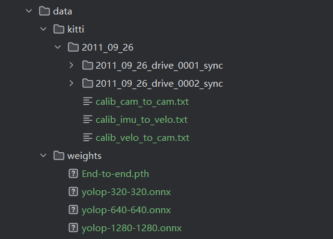

基于视觉语义与单线激光雷达几何特征融合的路缘检测系统
(Curb Detection based on Vision Semantics and Single-beam LiDAR Geometry Fusion)

1. 项目简介
  本项目针对现有纯视觉算法存在边界溢出、单线激光雷达易受路面噪点干扰等痛点，基于 KITTI 自动驾驶数据集，设计并实现了一套决策级多模态后融合路缘检测架构。
  系统深度耦合了前视图像的宏观语义表征与点云的三维局部几何形态，提出了基于语义遮罩（Semantic Masking）的跨模态判断机制，构建了低成本、轻量化的高精度物理边界检测范式。

2. 环境依赖与安装
  本项目已实现高度工程化封装，支持跨平台一键部署。强烈建议在 Conda 或 venv 虚拟环境中运行。

第一步：激活您的虚拟环境（以 本人使用的 Conda 为例）
> conda create -n kitti_yolop python=3.8

> conda activate kitti_yolop

第二步：一键安装核心依赖包
进入本项目根目录，执行以下命令安装依赖：
> pip install -r requirements.txt

3. 数据集与权重准备
为保证程序能够打开即用，请确保您的项目目录严格遵循以下结构存放数据和权重文件。如下图所示，将kitti官网下载的数据集放在kitti文件夹下,如果有多个，可通过修改[save_lidar_data.py](save_lidar_data.py)#原始数据配置里的date和drive进行更改数据集

4. 结果查看
运行main.py,程序运行结束后，所有的中间产物及最终结果均自动保存在 output/ 文件夹中
